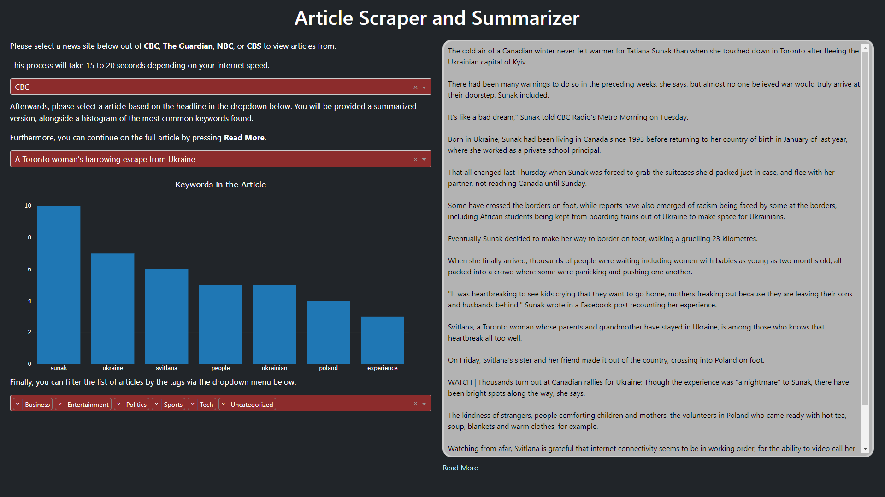

# Article Summarizer Application
This project scrapes articles from the front page of [CBC](https://www.cbc.ca/news/canada), [The Guardian](https://www.theguardian.com/international), [NBC](https://www.nbcnews.com/) and [CBS](https://www.cbsnews.com/). In addition, it provides a summarized version of the text using an extractive summarization technique alongside keywords present in the article. Furthemore, you can filter the category of the raticle by: Business, Entertainment, Politics, Sports, Technology, and Uncategorized.

  

## Dataset
The [dataset](http://mlg.ucd.ie/datasets/bbc.html) of BBC articles was used in training the SVM (support vector machine) and tfidf (term frequency–inverse document frequency) vectorizer for the categorization of articles. It contains 2225 articles evenly split between the five categories of business, entertainment, politics, sports, and technology.

## Method
### Summary 
The application uses an extractive summarization technique where the occurrence of a word describes it's importance to the article. Each word is given a score proportional to the number of occurence within the article. Afterwards, the importance of a sentence is simply the the sum of the scores of their words. The sentences are then ranked based on total importance, and the most important ones are kept. The remaining sentences are then returned in chronological order.

### Classification
The SVM and tfidf was trained on the data from the BBC. In order to select the best hyperparameters, a random search is first done to gain some intuition on the selection of hyperparameters. A more rigorous grid search is then used centered around the values provided by the random search. The best model found in this grid search is then used. The model was able to achieve a testing accuracy of 95.51% in categorizing. 

When the category of an article is inconclusive, the article is marked as uncategorized instead. This could be because it contains aspects of more than one category or it doesn't necessarly fit one of the 5 models.

## Running the Application

You can run the program as either a local copy, or online hosted on Heroku.

### How to Run the App Locally

The [requirements.txt](requirements.txt) file provides you with all the packages required for your environment in order for the program to run. 

You can run the app via:

    python dashwebsite.py

Then in your desired browser access the localhost provided. 

### Hosting on Heroku

The application is also hosted online on Heroku which can be accessed [here](https://article-summarizer-application-fb84fcfa5dbd.herokuapp.com/)
  
